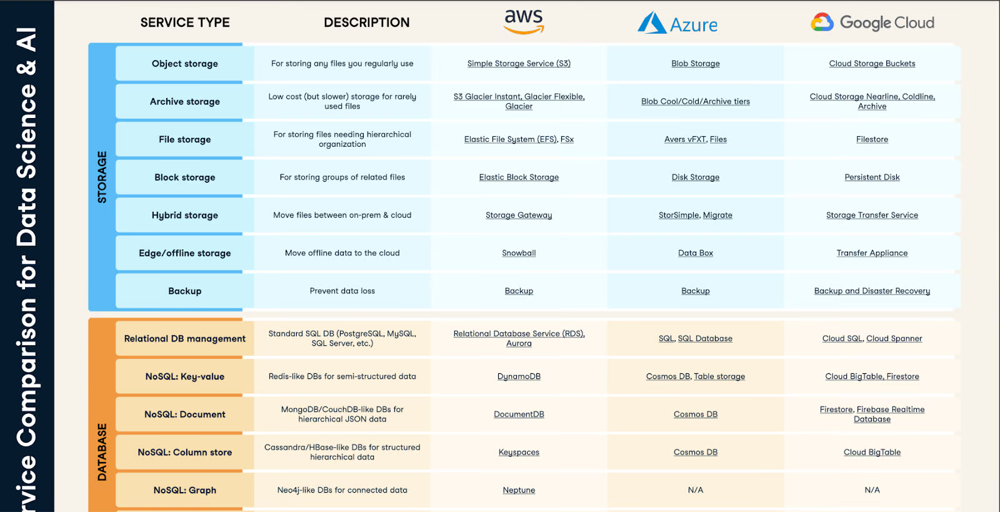

Vergleich der relevanten Kriterien für Microsoft Azure vs Amazon Web Services (AWS):

| Kriterium          | Azure                                                                 | AWS                                                                 |
|--------------------|-----------------------------------------------------------------------|---------------------------------------------------------------------|
| **Kostenstruktur** | Pay-as-you-go-Modell mit verschiedenen Preisstufen und Rabattoptionen. Kostenanalyse und -management sind integriert. | Pay-as-you-go-Modell mit flexiblen Preisstufen und Rabattoptionen. Kostenanalyse und -management sind integriert. |
| **Skalierbarkeit** | Flexibel skalierbare Dienste wie virtuelle Maschinen, Containerdienste und Serverless Computing. Automatische Skalierung und Lastverteilung. | Flexibel skalierbare Dienste wie virtuelle Maschinen, Containerdienste und Serverless Computing. Automatische Skalierung und Lastverteilung. |
| **Sicherheit**     | Umfassende Sicherheitsmassnahmen wie Identitäts- und Zugriffsmanagement, Verschlüsselung, Bedrohungserkennung und Compliance-Tools. | Umfassende Sicherheitsmassnahmen wie Identitäts- und Zugriffsmanagement, Verschlüsselung, Bedrohungserkennung und Compliance-Tools. |
| **Verfügbarkeit**  | Hohe Verfügbarkeit durch Verfügbarkeitszonen und Redundanz. | Hohe Verfügbarkeit durch Verfügbarkeitszonen und Redundanz. |
| **Zuverlässigkeit**| Zuverlässige Infrastruktur mit regelmässigen Updates und Patches. | Zuverlässige Infrastruktur mit regelmässigen Updates und Patches. |
| **Kundensupport**  | Umfassender Support inklusive Schulung, Beratung und technischer Unterstützung. | Umfassender Support inklusive Schulung, Beratung und technischer Unterstützung. |

Quelle: [datacamp](https://www.datacamp.com/blog/aws-vs-azure)
Beide Plattformen bieten ähnliche Dienstleistungen und haben ihre eigenen Stärken und Schwächen. Die Wahl zwischen Azure und AWS hängt oft von den spezifischen need Ihrer Organisation ab.

### **Kostenstruktur**
- **Azure**: Bietet eine Pay-as-you-go-Preismodell mit mehreren Preisstufen und Rabattmöglichkeiten. Azure hat Tools zur Kostenanalyse und -verwaltung integriert.
- **AWS**: Hat ebenfalls ein Pay-as-you-go-Modell mit flexiblen Preisstufen und Rabatten. AWS bietet umfangreiche Tools für die Kostenanalyse und -verwaltung an.

### **Skalierbarkeit**
- **Azure**: Bietet flexible Skalierbarkeit mit Diensten wie virtuellen Maschinen, Containerdiensten und serverlosem Computing. Unterstützt automatische Skalierung und Lastverteilung.
- **AWS**: Sehr ähnlich, bietet eine breite Palette skalierbarer Dienste wie EC2-Instanzen, Containerdienste und Lambda für serverloses Computing. Unterstützt ebenfalls automatische Skalierung und Lastverteilung.

### **Sicherheit**
- **Azure**: Umfassende Sicherheitsmassnahmen, einschliesslich Identitäts- und Zugriffsverwaltung, Verschlüsselung, Bedrohungserkennung und Compliance-Tools. Azure Active Directory ist ein starkes Sicherheitsmerkmal.
- **AWS**: Bietet auch umfassende Sicherheitsmassnahmen wie IAM (Identity and Access Management), Verschlüsselung, Bedrohungserkennung und Compliance-Tools. Hat eine Vielzahl von speziellen Sicherheitsdiensten wie GuardDuty und Macie.

### **Verfügbarkeit und Zuverlässigkeit**
- **Azure**: Hohe Verfügbarkeit durch mehrere Verfügbarkeitszonen und Redundanz. Bietet Service Level Agreements (SLAs) für fast alle Dienste.
- **AWS**: Sehr ähnliche Verfügbarkeit mit mehreren Verfügbarkeitszonen und hoher Redundanz. Ebenfalls sehr zuverlässige Infrastruktur mit SLAs für die meisten Dienste.

### **Kundensupport**
- **Azure**: Umfassender Support inklusive Schulung, Beratung und technischer Unterstützung. Azure hat spezifische Support-Pläne für verschiedene Geschäftsanforderungen.
- **AWS**: Bietet ebenfalls umfangreichen Support, einschliesslich Schulungen, Beratungen und technischer Unterstützung. Hat eine Vielzahl von Support-Plänen, die je nach Bedarf angepasst werden können.

